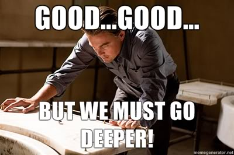

Goals
-----

For the rest of the bootcamp, we will focus on Python. The goals of  modules is
not specifically to make you an expert on Python itself. While we love Python,
we actually want  to teach you the basic, core concepts of programming that
transcend languages,  how they fit together, and how you can use them to become
a better scientist. 

By the end of these scientific Python lessons, you will be able to:

1.	Describe and distinguish the seven core elements shared by all programming 
	languages.
2.	Use Python to write simple programs that use these core elements, using 
	both the core library and scientific packages such as numpy.
3.	Make and save simple publication-quality plots using matplotlib.
4.	Read, manipulate, and save data files in csv and text formats.
5.	Write unit tests to confirm the accuracy of your Python code.
6.	Create standalone Python scripts that can be run from the command line,
	and work-flows for reproducible research.

We recognize that you all unavoidably have come with very different levels of
background in programming. We expect that some of you might be experienced in
basic programming and a few of you of might have some experience with Python,
and with additional modules such as numpy and scipy - for those in that
category, this section of the workshop may not be as novel as the other
sections. We hope that our presentation will help to solidify your existing
knowledge, and give you some insight. 

For those who have no (or almost no) background in programming in any language, 
you may find that these lessons proceed quickly. We encourage you to make 
liberal use of the helpful volunteers as we proceed through these lessons. You 
may also wish to consider working together with a partner to complete the 
exercises as a team.

The Seven Core Concepts
-----------------------

As noted by Greg Wilson (the founder of Software Carpentry), every programming 
language shares [seven core elements][1]:

1.	Individual things (the number 2, the string 'hello', a matplotlib figure)
2.	Commands that operate on things (the + symbol, the `len` function)
3.	Groups of things (Python lists, tuples, and dictionaries)
4.	Ways to repeat yourself (for and while loops)
5.	Ways to make choices (if and try statements)
6.	Ways to create chunks (functions, objects/classes, and modules)
7.	Ways to combine chunks (function composition)

The lines between these are often blurry in practice - for example, a string in 
Python actually mixes some characteristics of a thing, a group, and a "chunk". 
The distinctions between these categories is not particularly relevant to the 
computer - they are purely a conceptual framework that helps programmers write 
code that does what they want it to do.

We expect that you'll find the basics of 1 and 2 fairly straightforward. We'll 
go quickly through those and will spend the most time on items 3-6. We won't 
really talk about 7 much.

## Intro to Python

Let's first talk about Python:

### Python is a general-purpose high-level programming language. 

- "General purpose" : It is used for many applications, including, but not limited to
scientific applications. 

- "High-level" means that the language is relatively abstract, so that programs
written in the language abstract away the details of the implementation. This
is good, because it makes writing programs in Python simple, and portable.

The language was originally designed by a Dutch computer scientist named Guido
van Rossum, as a teaching language. GvR was a fan of the Monthy Python comedy
troupe, so the name really doesn't have much to do with snakes.

### Python is open source and free (as in "free beer" and as in "free speech").

## Inception:

Programming languages are a way for us give the computer instructions. We
"incept" our ideas into the computers brain. 

Let's start by writing our first python program. Open a text editor and type:

    print("Hello Software Carpentry")

Save the file as "hello.py". Then navigate the shell to where you save the
program and type:

    $ python hello.py

We have managed to take control of the machine! 
   
## Good, but we must go deeper: interactive work

Often, we will want to interact with the computer. Interactive sessions can be
evoked by typing

    $ python

While we're here, let's define a thing. That's called a 'variable'! We've
incepted an idea in the computers mind (memory, really)! 

But the truth is that the python interactive interperter is a bit annoying: no
tab-completion; once you close it; you lose your history, you can't perform any
standard shell operations (try typing `ls`!).

## Even deeper: ipython

[IPython](https://www.ipython.org) is an enhanced interactive interpreter. To
start IPython, type:

    $ ipython

Try tab completing:

    In [1]: prin<tab>

Try interacting with the shell:

    In [2]: ls

We can assign values to variables and query the interactive namespace:

     In [3]: a = 1

     In [4]: whos
     Variable   Type    Data/Info
     ----------------------------
     a          int     1

And even operate on these variables:

    In [5]: a + 1
    Out [5]: 2

Python has many built-in functions, to operate on variables that you create:

    In[6]: my_string = "abc"
    In[7]: len(my_string)
 
IPython allows us to get help about these functions. Try typing:

    In[8]: len? 

IPython implements a set of 'magic' functions. For example:

    In [6]: %time a = 1

This is not "standard" Python, but is an extension of the language to add
convenience and functionality.

You can learn much more about the IPython magics by using the `%magic` magic:

    In [7]: %magic

This is all very nice - we are really feeling at home right here inside of our
computer's psyche, but what if you wanted to save a session and share it?
Or use a python session as the basis for a lesson? Or for a publication?

## Could we go deeper than that?

Yes! The next level deeper is to use the IPython *notebook* format. As we
continue diving into our computer's inner self, remember that we are just
sending neatly-encoded instructions to the computer, to remember stuff for us
(variables), or to operate on that stuff.

To start the notebook, please change your working directory to
`2014-01-27-Stanford/lessons/python` directory and type `ipython notebook` from the
commandline.  This will start the ipython notebook server and open a web
browser showing the ipython notebook dashboard.

[1]: http://software-carpentry.org/blog/2012/08/applying-pedagogical-principles-in-this-course.html
